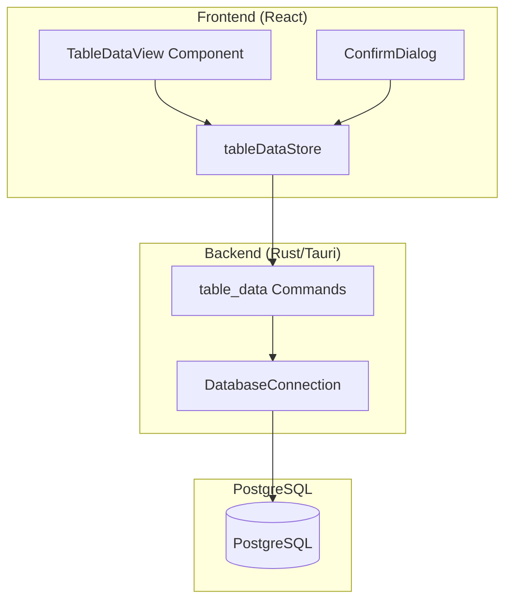
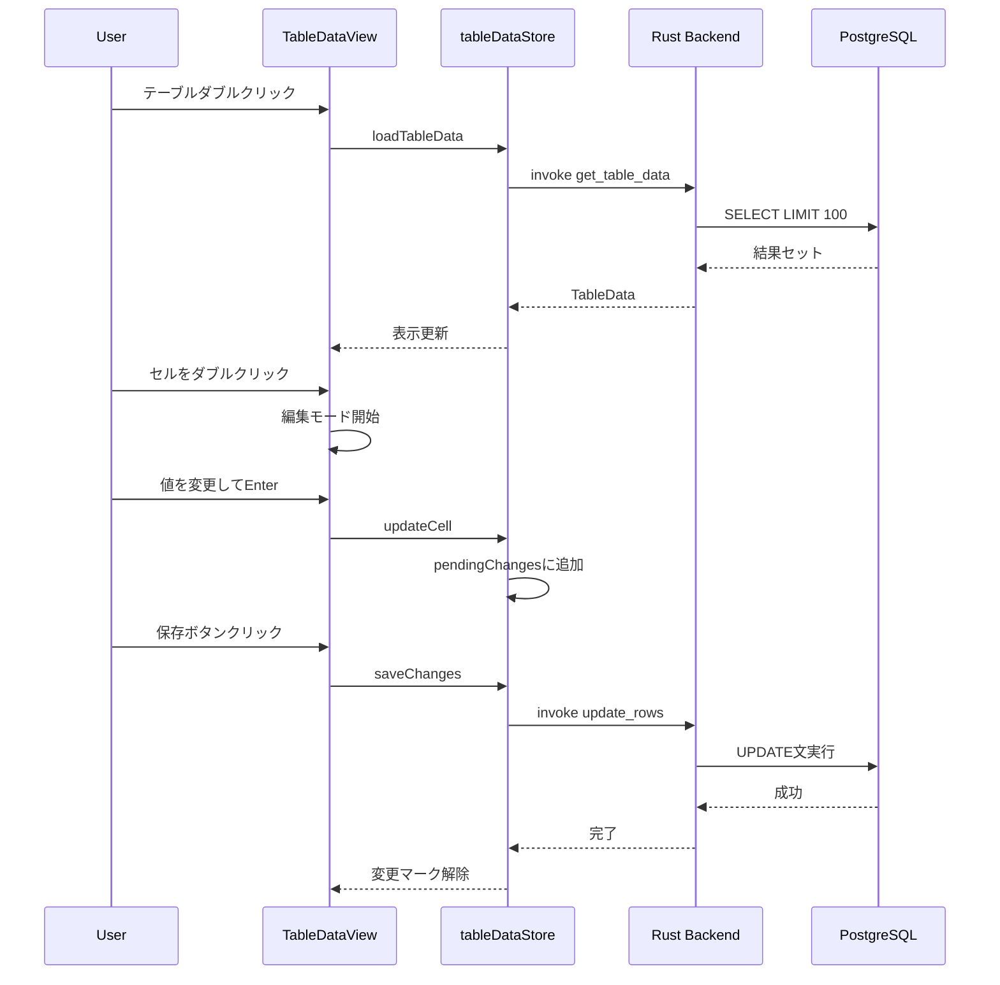
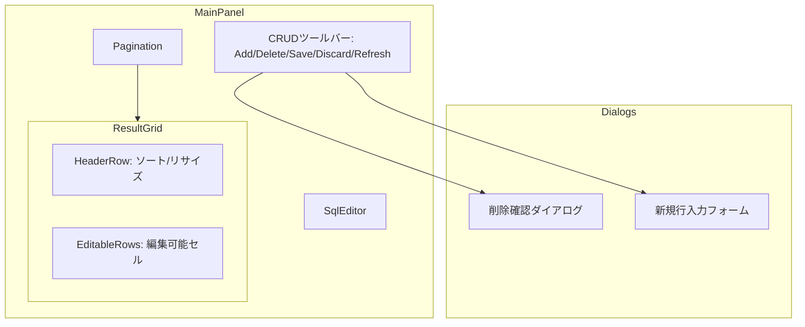
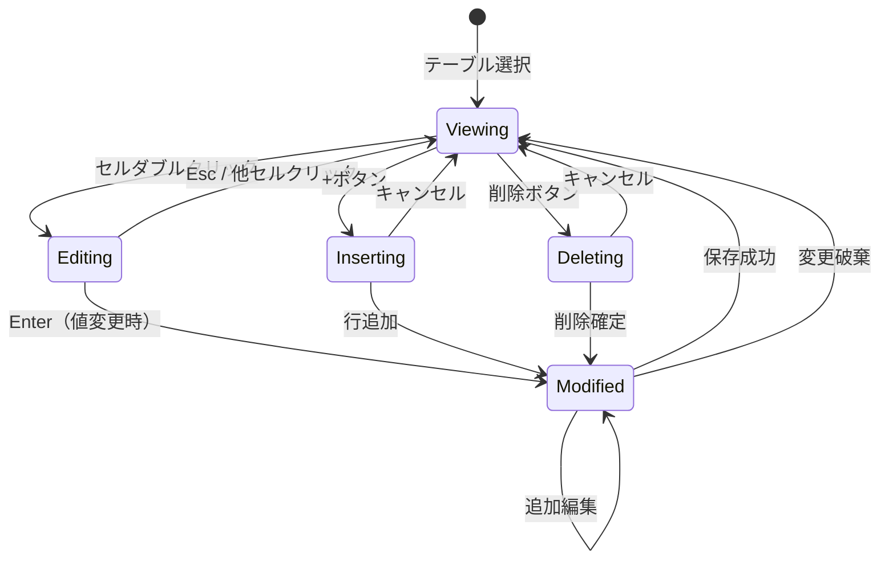

# テーブルCRUD操作 設計ドキュメント

## 概要

dbpilotアプリケーションにおいて、PostgreSQLテーブルのデータに対するCRUD（Create, Read, Update, Delete）操作をGUIから実行できる機能を追加する。ユーザーはクエリを手動で書くことなく、直感的なインターフェースでデータの閲覧・編集・追加・削除が可能になる。

## 目的

### なぜこの開発が必要か

1. **効率性の向上**: 単純なデータ操作のためにSQL文を毎回書く手間を省く
2. **ミス防止**: GUI操作により、SQL構文エラーやWHERE句の書き忘れによる誤操作を防止
3. **アクセシビリティ**: SQLに不慣れなユーザーでもデータベース操作が可能に
4. **競合製品との機能パリティ**: pgAdmin、DBeaver等の主要DBツールが持つ基本機能

### 代替アプローチの検討

| アプローチ | メリット | デメリット |
|-----------|---------|-----------|
| **GUI CRUD（採用）** | 直感的、ミス防止、初心者対応 | 実装コスト高 |
| SQLテンプレート生成 | 実装が簡単 | 結局SQL編集が必要 |
| AI自然言語→SQL | 柔軟性が高い | 既存機能と重複、精度問題 |

## やること（機能要件・非機能要件）

### 機能要件

#### FR-1: テーブルデータの閲覧（Read）
- サイドバーでテーブルをダブルクリックすると、そのテーブルのデータを表示
- ページネーション機能で大量データに対応
  - 1ページあたり50行表示（設定可能: 25/50/100）
  - 前へ/次へボタン、ページ番号直接入力
  - 総行数と現在のページ位置を表示
- ソート・カラムリサイズは既存のResultGridと同様

#### FR-2: 行の追加（Create）
- 「+」ボタンで新規行追加モードに入る
- 各カラムの入力フォームを表示（データ型に応じた入力UI）
- NOT NULL制約、デフォルト値を考慮
- 保存前に確認ダイアログを表示

#### FR-3: 行の編集（Update）
- セルをダブルクリックでインライン編集モードに入る
- 編集中のセルはハイライト表示
- Enterで確定、Escでキャンセル
- 変更行は視覚的にマーキング
- 一括保存ボタンで変更をコミット

#### FR-4: 行の削除（Delete）
- 行を選択して削除ボタンをクリック
- 複数行の一括削除に対応
- 削除前に確認ダイアログを必ず表示

#### FR-5: 主キーの扱い
- 主キーを持つテーブル: 主キーで行を一意特定、CRUD全操作可能
- 主キーがないテーブル: 読み取り専用（編集・追加・削除不可）
- 複合主キー対応

### 非機能要件

#### NFR-1: パフォーマンス
- 1000行以下のテーブルは1秒以内に表示
- 編集操作のレスポンスは200ms以内

#### NFR-2: 安全性
- 削除・更新操作は必ず確認ダイアログを表示
- トランザクションを使用し、エラー時はロールバック
- 制約違反時のエラーハンドリング
  - 外部キー制約違反: 保存せずにエラーメッセージを表示
  - NOT NULL制約違反: 保存せずにエラーメッセージを表示
  - 一意制約違反: 保存せずにエラーメッセージを表示
  - エラーメッセージには違反した制約名と対象カラムを含める

#### NFR-3: ユーザビリティ
- キーボードショートカット対応（Ctrl+S で保存等）
- アンドゥ機能（保存前の変更取り消し）

## やり方（実装詳細）

### システムアーキテクチャ



### データフロー



### データ構造

#### Rust Backend

```rust
// 新規追加: src-tauri/src/commands/table_data.rs

#[derive(Debug, Serialize, Deserialize)]
pub struct TableDataRequest {
    pub schema: String,
    pub table: String,
    pub limit: usize,
    pub offset: usize,
}

#[derive(Debug, Serialize, Deserialize)]
pub struct TableData {
    pub columns: Vec<ColumnInfo>,
    pub rows: Vec<TableRow>,
    pub total_count: usize,
    pub primary_keys: Vec<String>,
}

#[derive(Debug, Serialize, Deserialize)]
pub struct TableRow {
    pub id: String,  // 主キー値のJSON文字列（複合キー対応）
    pub values: Vec<serde_json::Value>,
}

#[derive(Debug, Serialize, Deserialize)]
pub struct RowUpdate {
    pub row_id: String,
    pub column: String,
    pub old_value: serde_json::Value,
    pub new_value: serde_json::Value,
}

#[derive(Debug, Serialize, Deserialize)]
pub struct RowInsert {
    pub values: HashMap<String, serde_json::Value>,
}

#[derive(Debug, Serialize, Deserialize)]
pub struct RowDelete {
    pub row_id: String,
}
```

#### Frontend Store

```typescript
// 新規追加: src/store/tableDataStore.ts

interface TableDataState {
  schema: string | null;
  table: string | null;
  columns: ColumnInfo[];
  rows: TableRow[];
  primaryKeys: string[];
  totalCount: number;

  // 編集状態
  pendingInserts: RowInsert[];
  pendingUpdates: Map<string, RowUpdate[]>;
  pendingDeletes: Set<string>;

  // UI状態
  isLoading: boolean;
  error: string | null;
  editingCell: { rowId: string; column: string } | null;
  selectedRows: Set<string>;
}
```

### Tauriコマンド

| コマンド | 説明 | 入力 | 出力 |
|---------|------|------|------|
| `get_table_data` | テーブルデータ取得 | TableDataRequest | TableData |
| `insert_rows` | 行追加 | schema, table, RowInsert[] | 追加行数 |
| `update_rows` | 行更新 | schema, table, RowUpdate[] | 更新行数 |
| `delete_rows` | 行削除 | schema, table, RowDelete[] | 削除行数 |
| `get_table_row_count` | 行数取得 | schema, table | number |

### UI コンポーネント構成



### CRUD操作フロー

```
サイドバー: テーブルダブルクリック
    ↓
SqlEditor: "SELECT * FROM schema.table LIMIT 50" 自動生成
    ↓
ResultGrid: データ表示（編集可能モード）
    ↓
ツールバー: Add/Delete/Save/Discard/Refresh ボタン表示
```

### ページネーション詳細

```
┌─────────────────────────────────────────────────────────────┐
│ [◀ 前へ] [1] [2] [3] ... [10] [次へ ▶]  │ 50行/ページ ▼ │
│                                          │ 全1234行中 1-50 │
└─────────────────────────────────────────────────────────────┘
```

- **LIMIT/OFFSET方式**: `SELECT * FROM table LIMIT 50 OFFSET 0`
- **総行数取得**: `SELECT COUNT(*) FROM table`（初回のみ）
- **ページ変更時**: 未保存の変更があれば警告

### エラー表示

```
┌─────────────────────────────────────────────────────────────┐
│ ⚠ 保存に失敗しました                                        │
│                                                             │
│ 外部キー制約違反: fk_orders_customer_id                     │
│ カラム「customer_id」の値「999」は                          │
│ 参照先テーブル「customers」に存在しません。                  │
│                                                     [閉じる] │
└─────────────────────────────────────────────────────────────┘
```

- エラー発生行をハイライト表示
- 該当セルに赤枠を表示
- 修正後に再度保存を試行可能

### 編集フロー状態遷移



### 修正対象ファイル

#### 新規作成

| ファイル | 説明 |
|---------|------|
| `src-tauri/src/commands/table_data.rs` | CRUD操作のTauriコマンド |
| `src/components/result/EditableCell.tsx` | 編集可能セル（データ型別UI） |
| `src/components/result/InsertRowDialog.tsx` | 新規行追加ダイアログ |
| `src/components/result/ConfirmDeleteDialog.tsx` | 削除確認ダイアログ |
| `src/components/result/Pagination.tsx` | ページネーション |

#### 修正

| ファイル | 修正内容 |
|---------|---------|
| `src-tauri/src/commands/mod.rs` | table_dataモジュール追加 |
| `src-tauri/src/lib.rs` | 新コマンド登録 |
| `src/components/result/ResultGrid.tsx` | 編集機能・ページネーション追加 |
| `src/components/layout/MainPanel.tsx` | CRUDツールバー追加 |
| `src/components/schema/SchemaTree.tsx` | ダブルクリックでSELECT自動生成 |
| `src/store/queryStore.ts` | 編集状態（pendingChanges）管理追加 |
| `src/types/query.ts` | 編集関連の型追加 |

## やらないこと

### MVP から除外する機能

1. **スキーマ変更操作**
   - ALTER TABLE（カラム追加・削除・変更）
   - インデックス作成・削除
   - 制約の追加・削除
   - → 理由: 危険度が高く、専用UIが必要

2. **高度なフィルタリング**
   - 複雑なWHERE条件のGUI構築
   - → 理由: SQLエディタで対応可能

3. **一括インポート/エクスポート**
   - CSVからの一括INSERT
   - → 理由: 既存のCSVエクスポート機能を拡張する別タスク

4. **行のコピー＆ペースト**
   - 行を複製して新規行として追加
   - → 理由: 後続バージョンで検討

5. **トランザクション制御UI**
   - 手動でのBEGIN/COMMIT/ROLLBACK
   - → 理由: 操作単位で自動トランザクション

6. **変更履歴・監査ログ**
   - 誰がいつ何を変更したかの記録
   - → 理由: スコープ外

## 懸念事項

### 技術的懸念

| 懸念 | リスク | 対策 |
|------|--------|------|
| 並行編集の競合 | 他ユーザーの変更を上書き | 楽観的ロック（バージョンチェック）は将来対応 |
| データ型の入力バリデーション | 不正な値でエラー | フロントエンドでの事前バリデーション |
| JSONB等の複雑な型 | 編集UIが複雑 | 初期はテキストエディタ、将来JSONエディタ |
| BLOB/BYTEA | バイナリデータの表示・編集 | 初期は「(binary)」表示、編集不可 |

### UX懸念

| 懸念 | 対策 |
|------|------|
| 誤削除 | 確認ダイアログ必須、複数行削除時は行数を明示 |
| 未保存変更の消失 | ページ遷移時に警告、変更マーカー表示 |
| 操作の複雑さ | ツールチップ、キーボードショートカット一覧 |

### 決定事項

1. **編集のトリガー**: ダブルクリック（誤操作防止）

2. **NULL値の入力方法**: 「NULL」と入力するとNULL値として扱う
   - 空文字列: 空の文字列として保存
   - 「NULL」（大文字小文字問わず）: NULL値として保存
   - 文字列として「NULL」を保存したい場合: 「'NULL'」とクォートで囲む

3. **自動生成カラムの扱い**
   - SERIAL / BIGSERIAL: INSERT時に入力不可（自動採番）
   - GENERATED ALWAYS AS: 常に読み取り専用
   - DEFAULT値あり: INSERT時に空欄ならDEFAULT適用、値入力も可能

4. **データ型別の入力UI**
   - BOOLEAN: チェックボックス
   - DATE: 日付ピッカー
   - TIMESTAMP: 日時ピッカー
   - TEXT(長文): 複数行textarea

5. **実装方針**: 既存のResultGridを拡張（新規コンポーネント不要）
   - サイドバーでテーブルダブルクリック → SELECT文自動生成 → ResultGridで表示・編集

6. **編集フロー**
   - セルをダブルクリック → 編集モード
   - Enterまたは別セルクリック → ローカルに保持（未保存マーク表示）
   - 複数セルを編集可能
   - 「Save」ボタン → DBに一括保存
   - 「Discard」ボタン → 未保存の変更を破棄

7. **リフレッシュ機能**: あり（未保存変更がある場合は警告）

## 参考資料

### 競合製品の調査

- **pgAdmin 4**: インライン編集、行追加はフォーム形式
- **DBeaver**: スプレッドシート風、セル単位の編集
- **DataGrip**: 高度なフィルタ、トランザクション表示

### 技術ドキュメント

- [Tauri Commands](https://tauri.app/v1/guides/features/command/)
- [sqlx Documentation](https://docs.rs/sqlx/latest/sqlx/)
- [React Table (参考)](https://tanstack.com/table/latest)

### 既存コードベース

- クエリ実行: `/src-tauri/src/commands/query.rs`
- スキーマ取得: `/src-tauri/src/commands/schema.rs`
- 結果表示: `/src/components/result/ResultGrid.tsx`
- テーブル詳細: `/src/components/schema/TableDetailPanel.tsx`